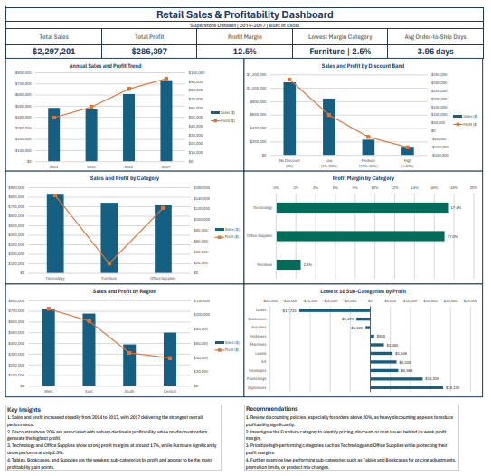
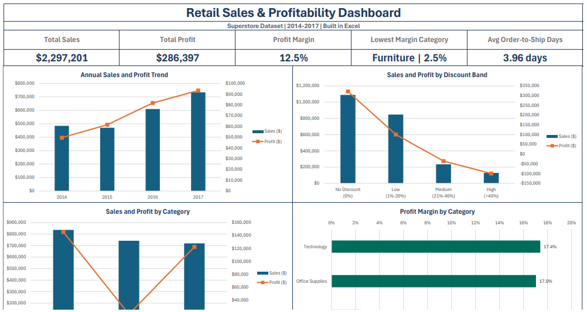
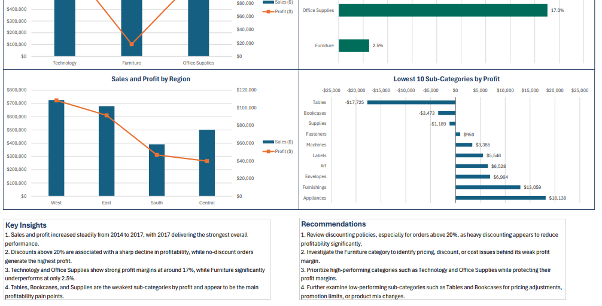

# Superstore Excel Dashboard

Portfolio Excel dashboard project using the Superstore dataset to analyze sales, profit, discount impact, category margins, and regional performance.

## Dashboard Preview

## Project Overview

This project was built in Excel to transform raw retail sales data into a clean, structured, and business-oriented dashboard.  
The goal was to identify performance trends, profitability drivers, weak product areas, and actionable recommendations through data cleaning, helper columns, pivot tables, charts, and KPI cards.

## Objectives

- Analyze overall sales and profit performance from 2014 to 2017
- Evaluate the impact of discounts on profitability
- Compare category and regional performance
- Identify the weakest sub-categories by profit
- Build a clear dashboard with KPIs, charts, insights, and recommendations

## Tools Used

- Microsoft Excel
- Pivot Tables
- Pivot Charts
- Calculated Fields
- Helper Column
- KPI Cards
- Dashboard Design and Layout Formatting

## Files Included

- Superstore_Excel_Dashboard_Portfolio.xlsx – complete Excel workbook
- images/dashboard-overview.png – full dashboard preview
- images/dashboard-top.png – top section preview
- images/dashboard-bottom.png – bottom section preview

## Dashboard Structure

The workbook is organized into three sheets:

- *Clean_Data*: cleaned dataset with helper columns such as profit margin, discount band, loss flag, shipping days, and date-related fields
- *Analysis*: pivot tables and intermediate charts used to explore the data
- *Dashboard*: final interactive-style presentation sheet with KPIs, charts, insights, and recommendations

## Key KPIs

- Total Sales: *$2,297,201*
- Total Profit: *$286,397*
- Profit Margin: *12.5%*
- Lowest Margin Category: *Furniture | 2.5%*
- Avg Order-to-Ship Days: *3.96 days*

## Key Insights

1. Sales and profit increased steadily from 2014 to 2017, with 2017 delivering the strongest overall performance.  
2. Discounts above 20% are associated with a sharp decline in profitability, while no-discount orders generate the highest profit.  
3. Technology and Office Supplies show strong profit margins at around 17%, while Furniture significantly underperforms at only 2.5%.  
4. Tables, Bookcases, and Supplies are the weakest sub-categories by profit and appear to be the main profitability pain points.  

## Recommendations

1. Review discounting policies, especially for orders above 20%, as heavy discounting appears to reduce profitability significantly.  
2. Investigate the Furniture category to identify pricing, discount, or cost issues behind its weak profit margin.  
3. Prioritize high-performing categories such as Technology and Office Supplies while protecting their profit margins.  
4. Further examine low-performing sub-categories such as Tables and Book

## Additional Screenshots

### Top Section

### Bottom Section

## Outcome

This project demonstrates an end-to-end Excel workflow: data preparation, exploratory analysis, KPI development, dashboard design, and business recommendation generation in a portfolio-ready format.
